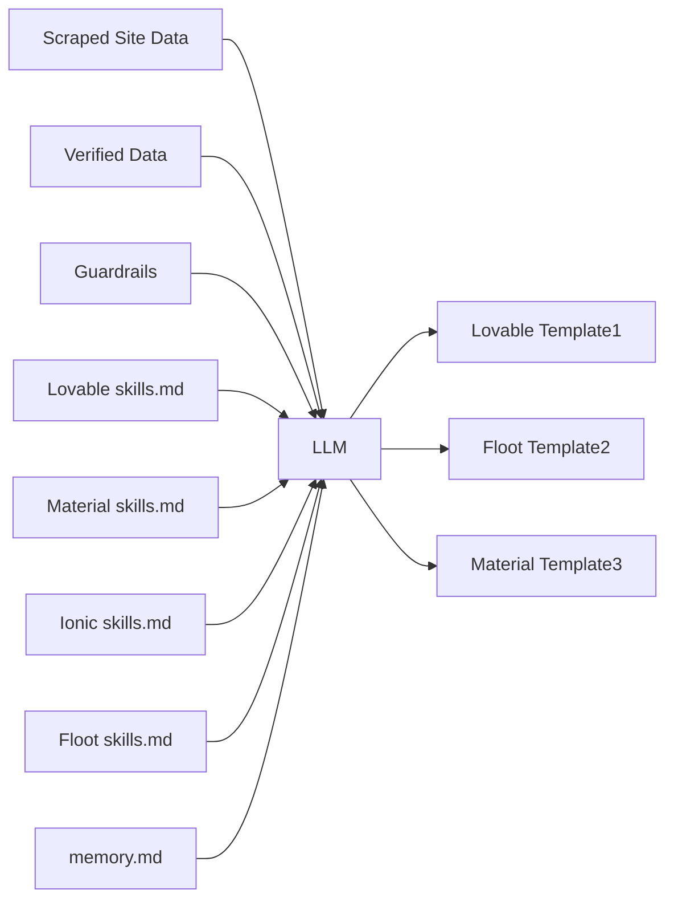

```mermaid
flowchart LR
    a["Scraped Site Data"] --> b["LLM"]
    a2["Verified Data"] --> b["LLM"]
    a3["Guardrails"] --> b["LLM"]
    skill1["Lovable skills.md"] --> b["LLM"]
    skill2["Material skills.md"] --> b["LLM"]
    skill3["Ionic skills.md"] --> b["LLM"]
    skill4["Floot skills.md"] --> b["LLM"]
    memory["memory.md"] --> b["LLM"]
    b["LLM"] --> t1["Lovable Template1"]
    b["LLM"] --> t2["Floot Template2"]
    b["LLM"] --> t3["Material Template3"]

```

